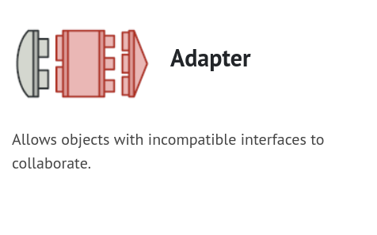
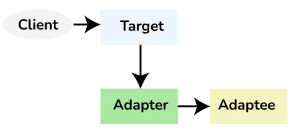

# Adapter (structural design pattern)



## References

- [Refactoring.guru](https://refactoring.guru/design-patterns)
- [GeeksForGeeks](https://www.geeksforgeeks.org/adapter-pattern)

## Document status

- [ ] Complete (Verified)
- [ ] Complete (Unverified)
- [x] In Progress

🗓️ Last updated: 09-14-2024

## Summary

- Adapter is a structural design pattern that allows objects with incompatible interfaces to collaborate.
- Adapter is a structural design pattern.
- AKA: Wrapper

---

## Introduction

Adapter Method or Adapter Design Patterns also knows as wrapper, convert the interface of a class into another interface clients expect. Adapter lets structs (class) work together that couldn’t otherwise because of incompatible interfaces.

## ⚠️ **Important Callouts** ⚠️

- Callout1
  - Sub-point1
  - Sub-point2

- Callout2
  - Sub-point1
  - Sub-point2

---

## Definition(s)

- **Term1**:
  - Definition1
  - Definition2

---

## Usage Guidelines

- When you do not need to change the existing object or interface, rather want to add new functionality on top of what is existing.
- Facilitates Single Responsibility Principle. You can separate the interface or data conversion code from the primary business logic of the program.
- Open/Closed Principle. You can introduce new types of adapters into the program without breaking the existing client code, as long as they work with the adapters through the client interface.
- Connecting your code to a 3rd party library with incompatible interfaces to your existing code.

### When ***NOT*** to use

- Specific business logic within a code base dont always need to have adaters when you control the client and business code. Adapters would just add un needed complexity.

## Components



1. **Target Interface**

   - Description: Defines the interface expected and used by the client. It represents the set of operations that the client code can use.
   - Role: It’s the common interface that the client code interacts with.

2. **Adaptee**

   - Description: The existing class or system with an incompatible interface that needs to be integrated into the new system. This is the object (struct instance) used by the `Adapter` to reuse the existing functionality and modify them for desired use.
   - Role: It’s the class or system that the client code cannot directly use due to interface mismatches.

3. **Adapter**

   - Description: A class that implements the target interface and internally uses an instance of the adaptee to make it compatible with the target interface. This is the `Wrapper` which implements the target interface and modifies the specific request available from the Adaptee class.
   - Role: It acts as a bridge, adapting the interface of the adaptee to match the target interface.

4. **Client**

   - Description: The code that uses the target interface to interact with objects. It remains unaware of the specific implementation details of the adaptee and the adapter.  The `Client` will interact with the `Adapter`.

   - Role: It’s the code that benefits from the integration of the adaptee into the system through the adapter.

## Diagrams

- 

- Description or explanation of the diagram.

## Implementation

- Step1
- Step2

## Code Block

```go
// logic

// comments

// output

```

## Code Block {} Explanation

- Variable:
- Functions:

---
